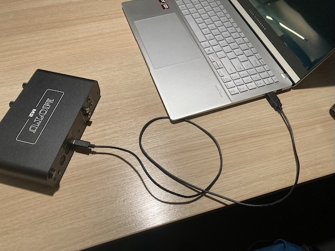

# InDeep Demonstrator Setup

This document describes how to set up the InDeep demonstrator for the Speech Science festival at Interspeech 2025.

## Hardware

Make sure to plug the speakers into power and the 3.5mm jack of the laptop:


Plug the **Motu** audio interface into the laptop using the supplied USB cable:



Plug the microphone into the **Motu** audio interface:


Turn on the audio interface (using the button on the back), and make sure the microphone is receiving phantom power by pressing the 48V button:


Make sure Windows uses the **Motu** as the input and the speakers as the output. The speakers may show up as headphones:


## Software

Make sure the laptop is connected to the Radboud Network (through eduVPN Client, shortcut on the desktop). See instructions below if you do not have access to Radboud Network over VPN.

Open up two Command Prompt windows. One will run the client-side application and the other will run the server-side application

### Client Side

#### First time set up

1. Download codebase from GitHub: `git clone https://github.com/timjzee/indeep-demonstrator.git`
2. Install Python 3.10.xx (if not installed)
3. Create (`python3 -m venv env`) and activate (`source env/bin/activate` for Linux, `env\Scripts\activate.bat` for Windows) a Python venv in the root of the project called "env"
4. Install libraries from requirements.txt to venv (`pip install -r requirements.txt`)
5. Create ".env" file in project root with following contents: 

```py 
PYTHONPATH=.
DEMONSTRATOR_MODE="client"
DEMONSTRATOR_PROFILE="default"
```

#### Set up

1. In the first Command Prompt window, navigate to the repo folder, e.g. : `cd C:\Users\experiment\Documents\indeep-demonstrator`
2. Start the virtual environment: `env\Scripts\activate.bat`
3. Start the demonstrator client: `python src\main.py`

### Server Side

#### First time set up

1. ssh to lightning: `ssh username@lightning.science.ru.nl`. If you do not have access to Radboud eduVPN, you will need to do: `ssh -J username@lilo.science.ru.nl username@lightning.science.ru.nl`
2. enter the demonstrator container: `sudo /etc/cncz/bin/incusexec demonstrator`
3. create a user with the same name and password as your ponyland account: `sudo adduser username`
4. add yourself to the `demo` group: `sudo usermod -aG demo username`
5. logout of the container and lightning: `exit` twice

#### Set up

1. Set up a SSH tunnel to the container: `ssh -L 8031:localhost:8031 -J username@lightning.science.ru.nl username@10.208.155.7` You will need to enter your password multiple times. If you do not have access to Radboud eduVPN, you will need to do: `ssh -L 8031:localhost:8031 -J username@lilo.science.ru.nl,username@lightning.science.ru.nl username@10.208.155.7`
2. Enter the demonstrator folder: `cd /home/timzee/indeep-demonstrator`
3. Start the virtual environment: `source env/bin/activate`
4. Start the demonstrator server: `python src/main.py`
5. Make sure the server recognizes the GPU. The initial output during startup should look like:

```shell
(env) timzee@demonstrator:~/indeep-demonstrator$ python src/main.py
Flash attention 2 is not installed
Starting Demonstrator in server mode using default profile.
cuda
NVIDIA A2
```

If the GPU is not recognized, try restarting the container:
- Exit the container
- SSH into lightining: `ssh username@lightning.science.ru.nl`
- Stop the container: `sudo /etc/cncz/bin/incusstop demonstrator`
- Start the container back up: `sudo /etc/cncz/bin/incusstart demonstrator`
- Recreate the ssh tunnel (see step 1 above)

### Using the Demonstrator

When both client and server are set up you can start the demonstrator in the client window, by typing either "e" (English) or "n" (Nederlands) and pressing Enter. This will make the demonstrator introduce itself in the chosen language. Pressing enter again makes the demonstrator listen. Whenever the participant stops talking the recorded speech is sent to the server, which then sends back a response.

